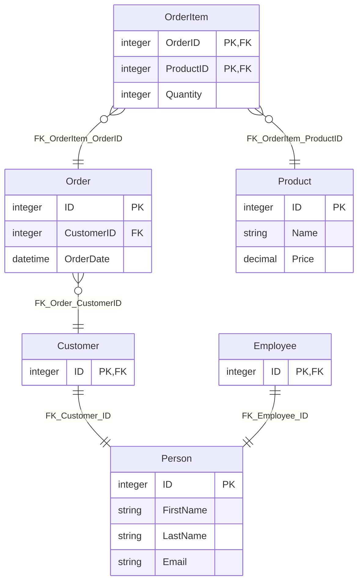

```mermaid
erDiagram
Person {
  integer ID  PK
  string FirstName 
  string LastName 
  string Email 
}
Employee {
  integer ID  PK, FK
}
Customer {
  integer ID  PK, FK
}
Order {
  integer ID  PK
  integer CustomerID  FK
  datetime OrderDate 
}
Product {
  integer ID  PK
  string Name 
  decimal Price 
}
OrderItem {
  integer OrderID  PK, FK
  integer ProductID  PK, FK
  integer Quantity 
}
Customer ||--|| Person : "FK_Customer_ID"
Employee ||--|| Person : "FK_Employee_ID"
Order }o--|| Customer : "FK_Order_CustomerID"
OrderItem }o--|| Order : "FK_OrderItem_OrderID"
OrderItem }o--|| Product : "FK_OrderItem_ProductID"
```